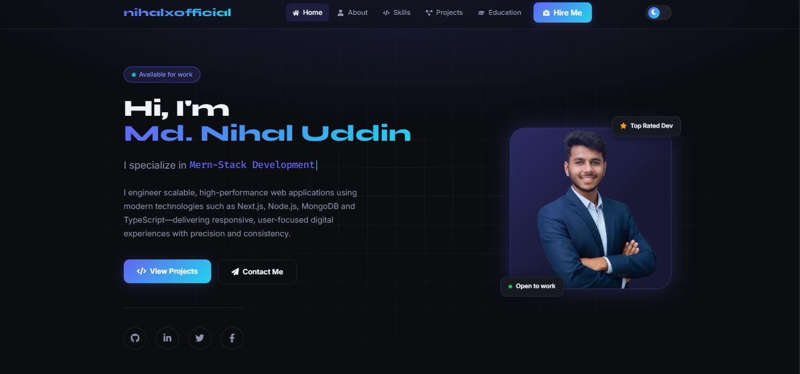

# Nihal Uddin | Professional Developer Portfolio

A high-performance, cinematic personal portfolio built to showcase Full-Stack development skills, projects, and professional experience. Designed with a focus on immersive user experience, it features butter-smooth scroll animations, glassmorphism UI elements, and a fully functional serverless contact system.

 *(Note: Add a screenshot of the portfolio to `/public/preview.png`)*

## ✨ Key Features

- **Cinematic Scroll Experience:** Uses `Lenis` for premium smooth scrolling physics combined with `GSAP` ScrollTriggers for stunning parallax and fade-up animations.
- **Dynamic Theming:** Seamless Dark and Light mode toggling with persistent state and custom CSS variables mapping to a refined color palette.
- **Micro-Interactions:** Magnetic buttons, interactive custom cursors, and fluid state transitions powered by `Framer Motion`.
- **Working Contact System:** Secure, server-side email processing using Next.js App Router API routes (`/api/contact`) and the **Resend API**.
- **Project Filtering Gallery:** Dynamically filterable project grid (All, Frontend, Full Stack, Next.js) with synchronized GSAP scrub animations.
- **Developer-Centric Typography:** Implements `Fira Code` for a realistic terminal typing effect in the hero section, alongside `Syne` and `Inter` for modern readability.
- **Interactive Location Map:** Theme-aware Google Maps embed precisely pinpointing the developer's location in Mirsarai, Chattogram.
- **Fully Responsive:** Mobile-first approach using Tailwind CSS, ensuring pixel-perfect layouts from smartphones to ultra-wide desktop monitors.

## 🛠️ Technology Stack

This project is built using modern web development standards and bleeding-edge libraries:

**Core Frameworks**
- [Next.js (App Router)](https://nextjs.org/) - React framework for SSR and API routes
- [React 19](https://react.dev/) - UI library
- [TypeScript](https://www.typescriptlang.org/) - Static typing for robust code
- [Tailwind CSS](https://tailwindcss.com/) - Utility-first styling framework

**Animation & Motion**
- [GSAP (@gsap/react)](https://gsap.com/) - High-performance scroll-linked animations and parallax timelines
- [Framer Motion](https://www.framer.com/motion/) - Fluid layout animations and UI transitions
- [Lenis](https://studiofreight.github.io/lenis/) - Vanilla smooth scroll physics engine

**Backend & Integrations**
- [Resend](https://resend.com/) - Reliable API for sending emails directly from the contact form
- Google Fonts (`next/font/google`)

## 🚀 Getting Started

Follow these steps to run the portfolio locally on your machine.

### Prerequisites
- Node.js (v18 or higher recommended)
- npm, yarn, or pnpm
- A free [Resend API](https://resend.com) key for the contact form

### Installation

1. **Clone the repository**
   ```bash
   git clone https://github.com/nihalxofficial/nihalxofficial-portfolio.git
   cd nihalxofficial-portfolio
   ```

2. **Install dependencies**
   ```bash
   npm install
   # or
   yarn install
   ```

3. **Environment Setup**
   Create a `.env.local` file in the root of the project and add your Resend API key:
   ```env
   RESEND_API_KEY=your_resend_api_key_here
   ```

4. **Run the Development Server**
   ```bash
   npm run dev
   # or
   yarn dev
   ```

5. **View the site**
   Open [http://localhost:3000](http://localhost:3000) in your browser.

## 📂 Project Structure

```text
├── app/
│   ├── api/contact/route.ts  # Serverless email handler (Resend)
│   ├── globals.css           # Global styles and theme tokens
│   ├── layout.tsx            # Root layout & providers
│   └── page.tsx              # Main entry point
├── components/
│   ├── providers/            # Theme & Smooth Scroll context providers
│   ├── sections/             # Hero, About, Projects, Education, Contact
│   └── ui/                   # Reusable components (Navbar, Toast, Modal)
├── context/
│   └── ThemeContext.tsx      # Dark/Light mode state management
├── data/
│   └── portfolio.ts          # Centralized data (Projects, Skills, Info)
└── hooks/
    └── useScroll.ts          # Custom hooks for UI state
```

## 📧 Contact & Support

Designed and Developed by **Md. Nihal Uddin**
- **Email:** mdnihaluddinbijoy@gmail.com
- **GitHub:** [nihalxofficial](https://github.com/nihalxofficial)

Feel free to fork this repository but please attribute the original design and code if you use it for your own portfolio.
